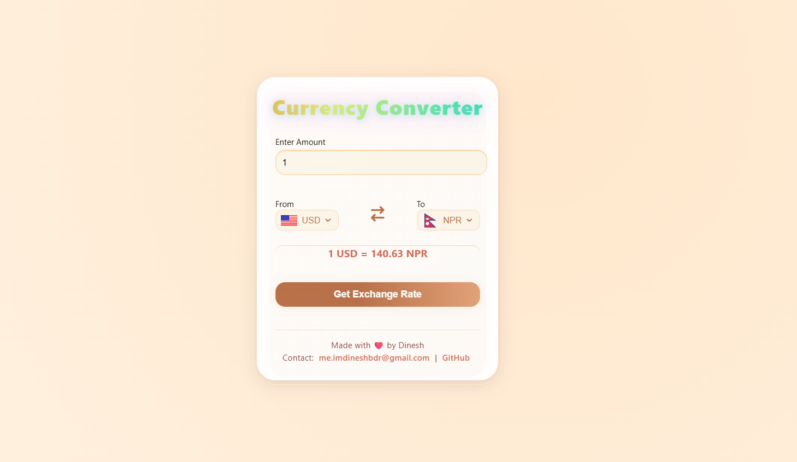

# Nepal Currency Converter

A beautiful, fast, and easy currency converter specially designed for Nepali users. Instantly convert between USD, NPR, INR, and more — free, simple, always updated, and with stunning interactive UI.

## 📷 Screenshot

**Live Demo:**  
[https://currency-converter-topaz-kappa.vercel.app/](https://currency-converter-topaz-kappa.vercel.app/)

## Features
- Lightning-fast currency conversion for major currencies
- Default USD-NPR for Nepali convenience
- Responsive for desktop and mobile
- Animated, modern design for awesome user experience
- Secure and privacy-friendly (no user data collected)

## Usage
Visit the live site above!  
No installation required.

---

## Author & Contact

Developed and maintained by **Dinesh Bahadur Shahi**  
Contact: [me.imdineshbdr@gmail.com](mailto:me.imdineshbdr@gmail.com)  
GitHub: [https://github.com/DineshBahadurShahi](https://github.com/DineshBahadurShahi)

---

## License & Copyright

Copyright © 2025 Dinesh Bahadur Shahi.  
All rights reserved.

## 🤝 Collaboration & Contributions

If you have ideas, suggestions, or wish to **collaborate** on improving this project,  
please reach out to the author directly via [me.imdineshbdr@gmail.com](mailto:me.imdineshbdr@gmail.com) or open an issue on GitHub.

All contributions and partnerships are welcome.

Please note: 
your feedback, feature ideas, and collaborative input are highly valued.

## Disclaimer

This site provides currency conversion for information purposes only. Exchange rates are updated automatically and may vary. Use at your own discretion.
